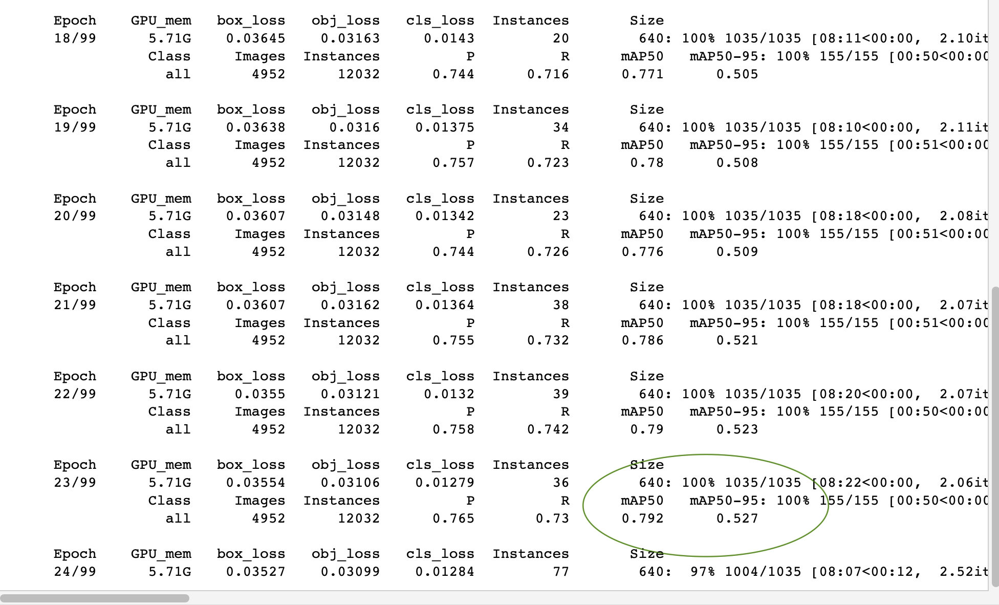
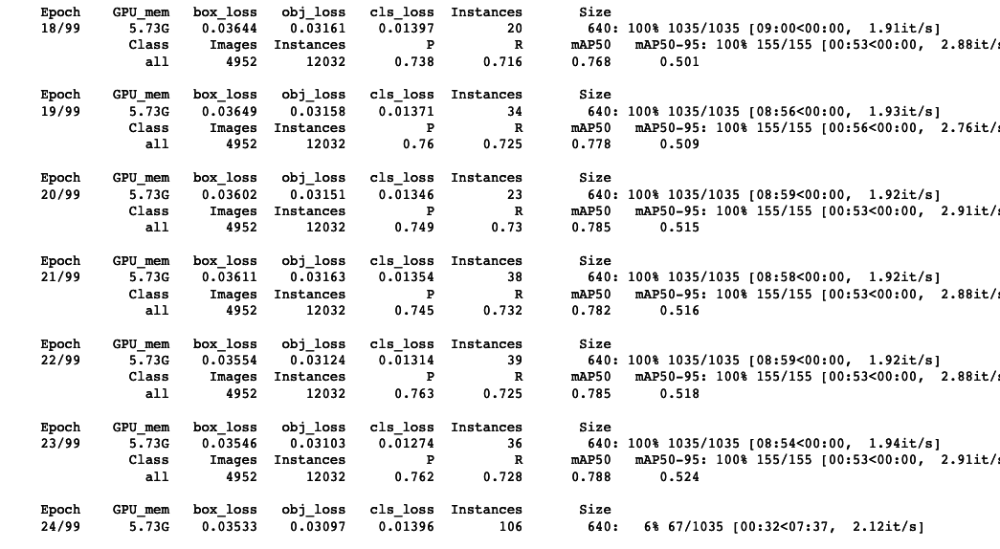

# 非结构化模型剪枝
也就在train.py添加了
```python
 '''模型微調'''
    module = None
    for name, m in model.named_modules():
        if isinstance(m, nn.Conv2d): # 如果是conv就進行剪枝
            module = m 
            break
    prune.random_unstructured(module, name="weight", amount=0.3)
    prune.remove(m, 'weight')  # make permanent 使微調有效
```
mAP50前后对比，0.04

